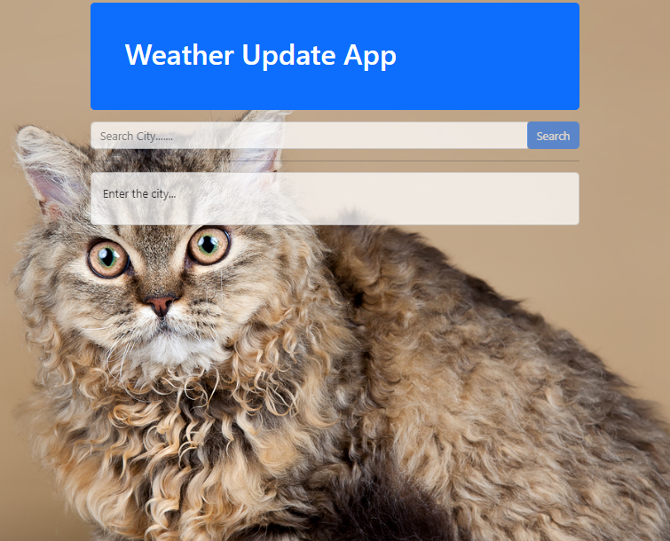

# Django Weather App Overview

## Introduction

Creating a weather app with Django involves integrating with a weather API to fetch real-time weather data and displaying it in a user-friendly manner

## Features

- Display the current weather conditions for the selected location.
- Provide a search bar where users can input the location (city) for which they want to check the weather.
- Integrate with a weather API (such as [OpenWeatherMAP](https://openweathermap.org/)) to fetch current weather data based on user input (e.g., city name, coordinates)
- Randomly selected cat image ans set as background. (from [TheCatAPI](https://thecatapi.com/))

## Prerequisites

Make sure you have the Python installed:

- Python (version 3.x recommended)

## Note:

In the command line, type `python`. If Python is installed, you should see a message like “Python 3.x.x” followed by the Python prompt, which looks like this “>>>”. Note that “3.x.x” represents the version number of Python

```bash
python
# OR
python --version
```

**1.Clone the Repo**

```sh
git clone https://github.com/Kaiyrtay/Django-WeatherApp.git
```

**2.Install Requirements**

```sh
cd ~/Django-WeatherApp/weatherapp
pip install -r requirements.txt
```

**3.Create .env**

```sh
cd ~/Django-WeatherApp/weatherapp
touch .env
```

At your .env file:

```bash
DEBUG=True/False

SECRET_KEY=<your_value>

WEATHER_API_KEY=<your_value>

CAT_API_KEY=<your_value>
```

**4.Start the development server:**

```bash
python manage.py check
python manage.py runserver
```

# Demo:

## Homepage



# End

> Good luck, more detail go to [OpenWeatherMAP](https://openweathermap.org/) and [TheCatAPI](https://thecatapi.com/)
